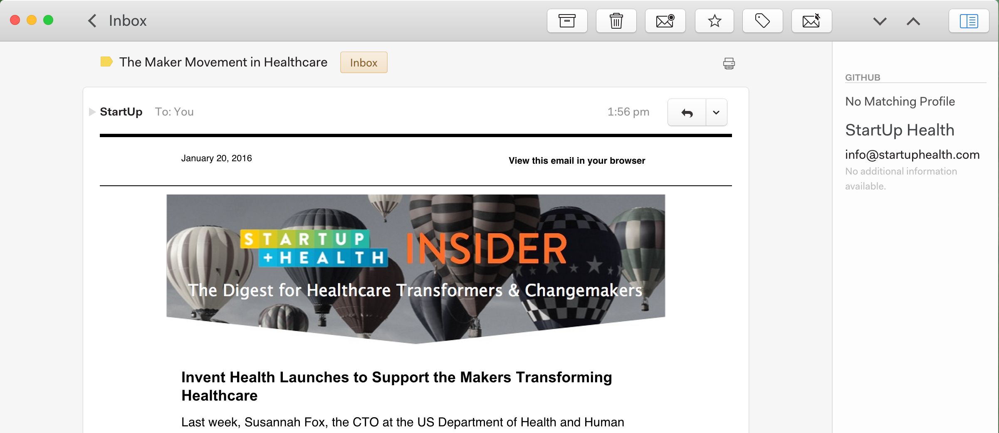

# n1-unsubscribe

This is a plugin for [Nylas N1](https://www.nylas.com/n1) that adds quick unsubscribe functionality.

If you encounter any issues, please report them [here as an issue][issues], so they can be fixed. Have a feature request or great idea? Also submit them through the issues pane and we will take a look as quickly as possible!

## Overview

- Quick action and Toolbar unsubscribe buttons
- Automated unsubscribe request for most email marketers
- Otherwise, opens a Browser Window within N1 for manual unsubscribing
- Auto-trash email after success

## Install this plugin

###### NOTE: Make sure that the downloaded folder is named `n1-unsubscribe` or you may encounter missing icons as mentioned in [#12](https://github.com/colinking/n1-unsubscribe/issues/12).

#### Via Releases

1. [Install N1](https://www.nylas.com/n1)

2. Download and un-zip `n1-unsubscribe.zip` from the [Releases page](https://github.com/colinking/n1-unsubscribe/releases/latest).

3. From the N1 menu, select `Developer > Install a Plugin Manually...`, then select the downloaded folder and the plugin will be installed.

4. You should see the plugin in the plugins pane in N1 (Preferences > Plugins).

#### Via Git

1. Navigate to the Nylas package directory (usually): `cd ~/.nylas/packages/`

2. Clone this repository: `git clone https://github.com/colinking/n1-unsubscribe.git`

3. Install the npm dependencies: `cd n1-unsubscribe; npm install`

4. Restart Nylas and you should see the plugin in the plugins pane in N1 (Preferences > Plugins) [as shown above]

5. *To update to the newest version, periodically run:* `git pull`

## Behind the Scenes

We use the list-unsubscribe header that is invisibly attached to most marketing emails. If there is no header, we scour the email body for an unsubscribe link or a phrase describing how to unsubscribe. Once a link is found, either an automated email will be sent or a mini browser will appear that will allow you to quickly unsubscribe without leaving N1. The email is trashed for you once this completes. An important note, if no unsubscribe action is available, the button will be hidden.

<!--#### Bulk Action-->

<!--(To Be Developed)-->

<!---->

#### Quick Action

From the comfort of your inbox view, you can easily unsubscribe from an email by tapping the new icon alongside the trash and archive buttons that you are used to. If no unsubscribe action is available, the button will be hidden.

#### Menu Item

While reading an email you may realize that you would like to unsubscribe, so instead of scrolling to the bottom of the email and playing the *spot the unsubscribe link game*, which is [an actual game](http://spottheunsubscribe.tumblr.com/), you can press the obvious button at the top.

## Future Features of n1-unsubscribe
- [ ] Undo unsubscribe action
- [ ] Edge case support
- [ ] Method to report a failed unsubscribe request

## Other possible features
- Better notification of in-progress unsubscribe
- Add a bulk-unsubscribe toolbar button that is enabled when selecting multiple emails
- Tests
- Travis CI and stricter linting?

## Made by
[Kyle King](http://kyleking.me) and [Colin King](http://colinking.co)

[Also StartupHealth is a great organization, they just happened to be at the top of my inbox](https://www.startuphealth.com/)

[issues]: https://github.com/colinking/n1-unsubscribe/issues

## Example

<!--http://giphy.com/gifs/627jdmLLrBHAQ-->

